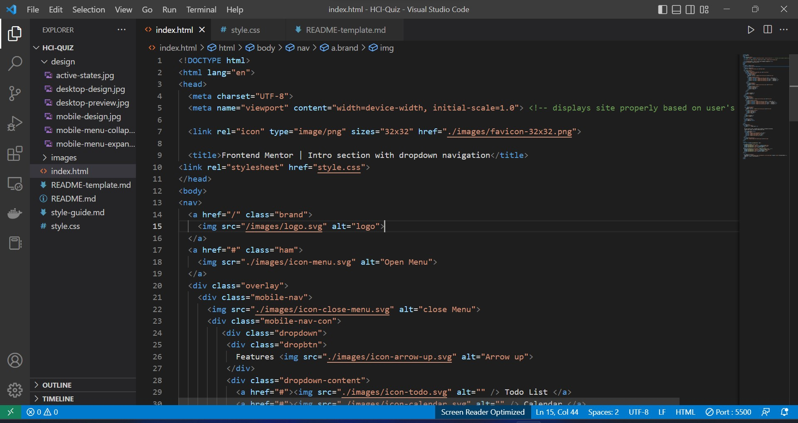

# Quiz 2 - Intro section page with interactive dropdown menu solution

This is a solution to the [Intro section page with interactive dropdown menu Quiz 2 challenge]

## Table of contents

- [Overview](#overview)
  - [The challenge](#the-challenge)
  - [Screenshot](#screenshot)
  - [Links](#links)
- [My process](#my-process)
  - [Built with](#built-with)
  - [What I learned](#what-i-learned)
  - [Continued development](#continued-development)
  - [Useful resources](#useful-resources)
- [Author](#author)

## Overview

### The challenge

Users should be able to:

- View the relevant dropdown menus on desktop and mobile when interacting with the navigation links
- View the optimal layout for the content depending on their device's screen size
- See hover states for all interactive elements on the page

### Screenshot

### Links

- Solution URL: [Solution](https://github.com/azzansm/HCI-Quiz)
- Live Site URL: [Live Site](https://azzansm.github.io/HCI-Quiz/)

## My process

### Built with

- HTML (+js)
- CSS

### What I learned

I learned how to make an interactive website with a dropdown menu using three programming languages.

### Continued development

I want to improve my CSS skills since I still need to become familiar with them. 

### Useful resources

- [Resource 1](https://youtu.be/KQfTynDkEng) - The video helped me complete this quiz - the explanation was clear enough for me to understand what he was doing on screen

## Your Detail 

- FullName - Azza Nasima
- StudentID - 2602158166
- BINUS Email - azza.nasima@binus.ac.id
